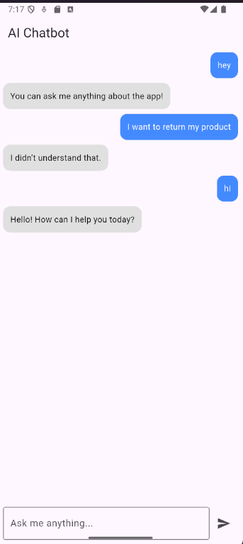

# 🤖 Chatbot – AI-Powered Flutter App

A simple and elegant **Flutter chatbot app** that integrates with **Dialogflow ES (free version)** to enable natural conversational experiences. Built using the **Bloc pattern** for structured and maintainable state management.

---

## ✨ Features

- Chat with an AI using **Dialogflow ES (Essentials)**
- Clean architecture using **Bloc (flutter_bloc)**
- Modern and responsive chat UI
- Handles user input, bot response, and loading state
- No Google Cloud billing required (uses Dialogflow ES free tier)

---

## 📱 Chat Screen Preview

---

## 🧰 Tools & Technologies Used

| Tool / Package         | Description                                           |
|------------------------|-------------------------------------------------------|
| **Flutter**            | Cross-platform UI toolkit                            |
| **Bloc (flutter_bloc)**| For state management                                 |
| **Dialogflow ES**      | AI platform for natural conversation (free tier)     |
| **http**               | For sending requests to Dialogflow API               |
| **Dart**               | Language used to build Flutter apps                  |

---

## 🚀 Getting Started

### Prerequisites

- Flutter SDK
- A Dialogflow ES agent
- A service account key (JSON) for authentication

